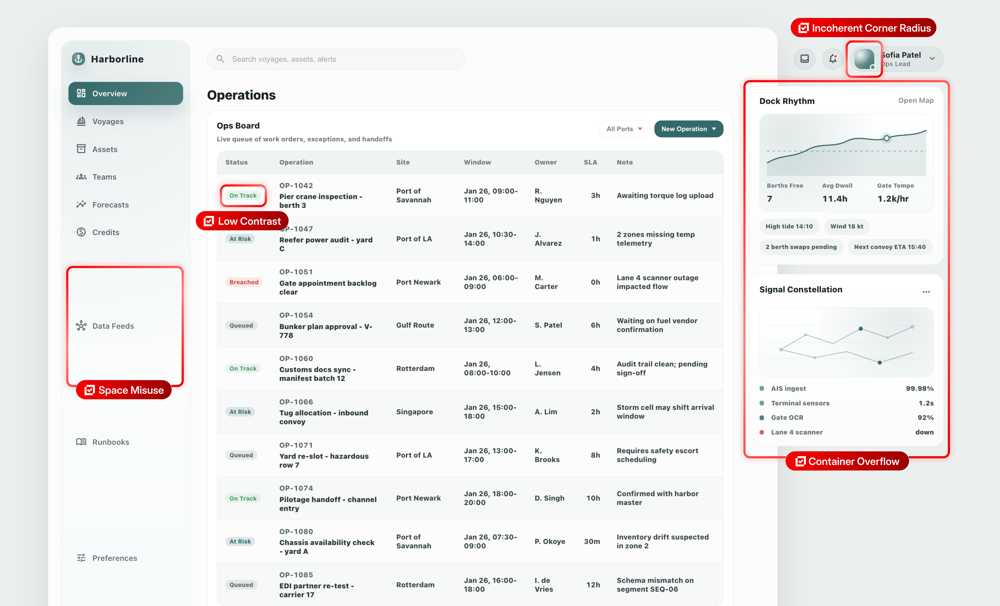
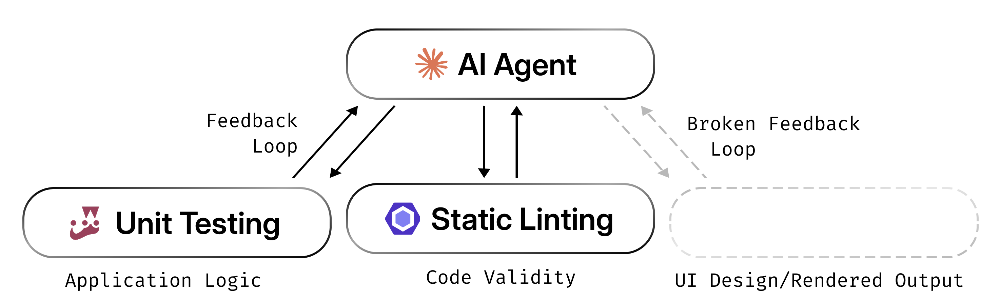
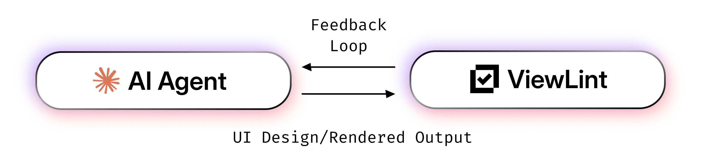

<h1>
<picture>
    <source media="(prefers-color-scheme: dark)" srcset="./apps/docs/public/viewlint-logo-white.svg" />
    <source media="(prefers-color-scheme: light)" srcset="./apps/docs/public/viewlint-logo.svg" />
    
</picture>
ViewLint
</h1>

[Documentation](https://viewlint.vercel.app/) | [NPM](https://www.npmjs.com/package/viewlint)

ViewLint helps identify UI issues by analyzing the rendered output a human sees, not just source code.

Built for modern coding workflows and AI Agents, ViewLint accelerates workflows from development to shipping. It's designed to be ready to use out-of-the-box and extensible when you need it, making it perfect for individual developers to enterprise organizations.



## Quick Start

Initialize ViewLint:

```bash
npm init @viewlint/config@latest
```

Run it on a URL:

```bash
npx viewlint https://example.com
```

For setup details and advanced configuration, see the [Getting Started guide](https://viewlint.vercel.app/docs/getting-started).

## The UI Linting Problem

UI issues such as clipped content, overflow, low contrast, and obscured hit targets are often hard to catch from source code alone.

Instead, ViewLint validates your UI the same way a human does, looking at and interacting with the actual rendered browser output to catch potential issues.

### UI's Broken Feedback Loop

LLMs are fantastic at writing code. They're not so great at making UI.

As it turns out, that's because Coding Agents have a closed feedback loop to validate their code and logic. But when it comes to UI, inspecting the DOM tree manually and taking screenshots just aren't concrete and actionable enough to close that feedback loop.



ViewLint closes the feedback loop with UI design, allowing the agent to get live, actionable feedback on the rendered output of the website it's working on.



ViewLint significantly improves the UI design performance of AI Agents. Learn more and see the difference at the [ViewLint documentation](https://viewlint.vercel.app/#viewlint-closes-the-loop).

## Documentation

Get started exploring ViewLint and add it to your project with the ViewLint documentation at [viewlint.vercel.app](https://viewlint.vercel.app).

- [Introduction](https://viewlint.vercel.app/docs)
- [Getting Started](https://viewlint.vercel.app/docs/getting-started)
- [Configure ViewLint](https://viewlint.vercel.app/docs/configure-viewlint)
- [CLI Reference](https://viewlint.vercel.app/docs/cli-reference)
- [Rules Reference](https://viewlint.vercel.app/docs/rules-reference)
- [MCP Server Setup](https://viewlint.vercel.app/docs/mcp-server)

## Repo Structure

ViewLint is a monorepo, hosting a series of packages in the ViewLint ecosystem as well as the documentation site.

* `apps/`
    * `docs/`: ViewLint documentation, hosted at [viewlint.vercel.app](https://viewlint.vercel.app)
* `packages/`
    * `viewlint/`: Core ViewLint package and CLI (`viewlint` on [NPM](https://www.npmjs.com/package/viewlint))
    * `rules/`: Core ViewLint rules (`@viewlint/rules` on [NPM](https://www.npmjs.com/package/@viewlint/rules))
    * `create-config/`: ViewLint config initializer (`@viewlint/create-config` on [NPM](https://www.npmjs.com/package/@viewlint/create-config))
    * `mcp/`: ViewLint MCP server (`@viewlint/mcp` on [NPM](https://www.npmjs.com/package/@viewlint/mcp))
    * `typescript-config/`: Shared TS config for monorepo

## License

AGPL-3.0-only
